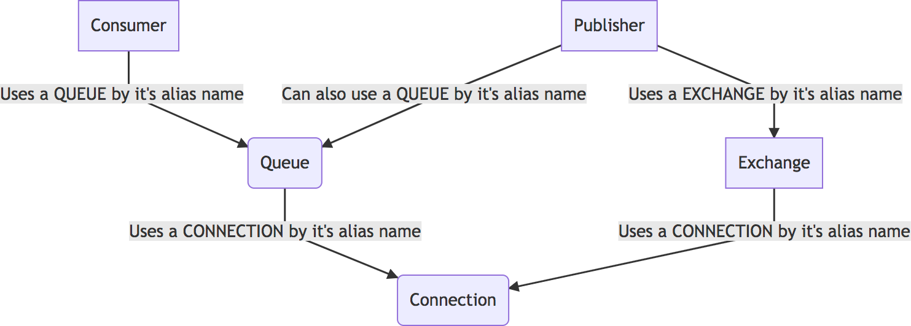

[](https://travis-ci.org/needle-project/process-transaction)
[](https://scrutinizer-ci.com/g/needle-project/laravel-rabbitmq/?branch=master)
[](https://scrutinizer-ci.com/g/needle-project/laravel-rabbitmq/?branch=master)
[](https://packagist.org/packages/needle-project/laravel-rabbitmq)

# Laravel RabbitMQ
A simple rabbitmq library for laravel based on Publish–Subscribe pattern where the subscriber is the Consumer.

# Table of Contents
1. [Install](#1-install)
2. [Configure](#2-configure)

    2.1. [Connections](#21-connection)

    2.2. [Queues](#22-queues)

	2.3. [Exchanges](#23-exchanges)

	2.4. [Publishers](#24-publishers)

	2.5. [Consumers](#25-consumers)

3. [Usage](#3-usage) 

	3.1. [Publishing a message](#31-publishing-a-message)

	3.2. [Consuming a message](#32-consuming-a-message)

	3.3. [Available CLI commands](#33-available-commands)

	3.4. [Custom Message Processor](#34-custom-message-processor)

4. [Contribute](#4-contribute)

# 1. Install
Run: 
```bash
composer require needle-project/laravel-rabbitmq
```
For Laravel version 5.5 or higher the library should be automatically loaded via [Package discovery](https://laravel.com/docs/5.6/packages#package-discovery).

For Laravel versions below 5.5 you need to add the service provider to `app.php`:
```php
<?php

return [
    // ...
    'providers' => [
        // ...
        NeedleProject\LaravelRabbitMq\Providers\ServiceProvider::class,
    ],
    // ...
];
```

# 2. Configure
* Create a new file called `laravel_rabbitmq.php` inside your Laravel's config directory.
(Or use `artisan vendor:publish` - Read more [here](https://laravel.com/docs/5.0/packages))
* Fill out the config based on your needs.

The configuration files has 5 main nodes: **connections**, **exchanges**,  **queues**, **publishers**, **consumers**.

They are used in the following mode:


Example config:
```php
return [
    'connections' => [
        'connectionA' => [/** Connection A attributes */],
        'connectionB' => [/** Connection B attributes */],
    ],
    'exchanges' => [
        'exchangeA' => [
            // Tells that the exchange will use the connection A
            'connection' => 'connectionA',
            /** Exchange A Attributes */
        ],
        'exchangeB' => [
            // Tells that the exchange will use the connection B
            'connection' => 'connectionB',
            /** Exchange B Attributes */
        ]
    ],
    'queues' => [
        'queueA' => [
            // Tells that the queue will use the connection alias A
            'connection' => 'connectionA',
            /** Queue A Attributes */
        ]
    ],
    'publishers' => [
        'aPublisherName' => /** will publish to exchange defined by alias */ 'exchangeA'
    ],
    'consumers' => [
        'aConsumerName' => [
            // will read messages from
            'queue' => 'queueA',
            // and will send the for processing to an "NeedleProject\LaravelRabbitMq\Processor\MessageProcessorInterface"
            'message_processor' => \NeedleProject\LaravelRabbitMq\Processor\CliOutputProcessor::class
        ]
    ]
]
```

### 2.1. Connections
**Connection attributes:**
* All attributes are optional, if not defined the defaults will be used.
                    
Attribute  | Type | Default value | Description
------------- | ------------- | ------------- | -------------
hostname  | string | 127.0.0.1 | The host for the RabbitMQ instance
port  | integer |5672 | The port for the RabbitMQ instance
username  | string | guest | Default's RabbiqMQ username
password | string | guest | Default's RabbiqMQ username
vhost  | string | / | RabbitMQ Virtual Host. Read more [here](https://www.rabbitmq.com/vhosts.html).
lazy  | boolean | true | Setting it lazy will only make the connection when an action that needs the connection willl be called
read_write_timeout  | integer | 3 | TTL for read/write operations.
connect_timeout  | integer | 3 | TTL for the connection
heartbeat  | integer | 0 | Whether to check the socket connection periodically. Read more [here](https://www.rabbitmq.com/heartbeats.html).
keep_alive | boolean | false | Whether to use system's keep alive property. Read more [here](https://www.rabbitmq.com/networking.html).

### 2.2. Queues
**Queue main nodes:**

Node key  | Type | Description
------------- | ------------- | -------------
connection | string | The reference to the connection that should be used.
name | string | The actual name of the queue on RabbitMQ
attributes | array | Optional attributes for the queue

*Queue attributes*

Attribute key  | Type | Default | Description
------------- | ------------- | ------------- | -------------
passive | boolean | false | This is an AMQP attribute. Read about [here] (https://www.rabbitmq.com/amqp-0-9-1-reference.html)
durable | boolean | false | Same as passive attribute
exclusive | boolean | false | Same as passive attribute
auto_delete | boolean | false | Same as passive attribute
internal | boolean | false | Same as passive attribute
nowait | boolean | false | Same as passive attribute
auto_create | boolean | false | Whether should try to create (and bind) the queue when queried.
throw_exception_on_redeclare | boolean | true | Throw exception when re-declare of the queue fails
throw_exception_on_bind_fail | boolean | true | Throw exception when cannot create the bindings
bind | array | empty | Whether should bind to an exchange: See Example 1. 

Example 1:
```php
[
	['exchange' => 'first.exchange', 'routing_key' => '*'],
	['exchange' => 'second.exchange', 'routing_key' => 'foo_bar'],
]
```

### 2.3. Exchanges
**Exchange main nodes:**

Node key  | Type | Description
------------- | ------------- | -------------
connection | string | The reference to the connection that should be used.
name | string | The actual name of the queue on RabbitMQ
attributes | array | Optional attributes for the exchange

*Exchange attributes*

Attribute key  | Type | Default | Description
------------- | ------------- | ------------- | -------------
exchange_type | string | - | **Mandatory** The type of the exchange (direct / fanout / topic / headers). View description [here] (https://www.rabbitmq.com/tutorials/amqp-concepts.html)
passive | boolean | false | This is an AMQP attribute. Read about [here] (https://www.rabbitmq.com/amqp-0-9-1-reference.html)
durable | boolean | false | Same as passive attribute
auto_delete | boolean | false | Same as passive attribute
internal | boolean | false | Same as passive attribute
nowait | boolean | false | Same as passive attribute
auto_create | boolean | false | Whether should try to create (and bind) the queue when queried.
throw_exception_on_redeclare | boolean | true | Throw exception when re-declare of the queue fails
throw_exception_on_bind_fail | boolean | true | Throw exception when cannot create the bindings
bind | array | empty | Whether should bind to an exchange: See Example 2. 

Example 2:
```php
[
	['queue' => 'first.exchange', 'routing_key' => '*'],
	['queue' => 'second.exchange', 'routing_key' => 'foo_bar'],
]
```
### 2.4. Publishers
A publisher push a message on an *exchange* (but it can also push it on a queue).
Defining a publishers:
```php
'publishers' => [
	'myFirstPublisher' => 'echangeAliasName',
	'mySecondPublisher' => 'queueAliasName'
	// and many as you need
]
```

### 2.5. Consumers
A consumer will alway get message from a queue.
Define a consumer:
```php
'consumers' => [
    'myConsumerName' => [
        'queue' => 'queueAliasName',
        'prefetch_count' => 1,
        'message_processor' => \NeedleProject\LaravelRabbitMq\Processor\CliOutputProcessor::class
    ]
]
```

Field  | Type | Description
------------- | ------------- | -------------
queue | string | Reference of the defined queue block.
prefetch_count | int | *Default: 1*. The number of the message that a cosumer will grab without ack. Read more [here](https://www.rabbitmq.com/consumer-prefetch.html)
passive | boolean | false | This is an AMQP attribute. Read about [here] (https://www.rabbitmq.com/amqp-0-9-1-reference.html)
durable | boolean | false | Same as passive attribute
auto_delete | boolean | false | Same as passive attribute
internal | boolean | false | Same as passive attribute
nowait | boolean | false | Same as passive attribute
auto_create | boolean | false | Whether should try to create (and bind) the queue when queried.
throw_exception_on_redeclare | boolean | true | Throw exception when re-declare of the queue fails
throw_exception_on_bind_fail | boolean | true | Throw exception when cannot create the bindings
bind | array | empty | Whether should bind to an exchange: See Example 2. 


# 3. Usage
After configuring, you should end up with a configuration file `laravel_rabbitmq.php` similar to this one:

```php
return [
    'connections' => [
        'connectionA' => [],
    ],
    'exchanges' => [
        'exchangeA' => [
            'connection' => 'connectionA',
			'name' => 'foo_bar',
			'attributes' => [
				'exchange_type' => 'topic'
			]
        ]
	],
    'queues' => [
        'queueB' => [
            'connection' => 'connectionA',
            'name' => 'foo_bar_listener',
			'attributes' => [
				'bind' => [
                    ['exchange' => 'foo_bar', 'routing_key' => '*']
                ]
			]
        ]
    ],
    'publishers' => [
        'aPublisherName' => 'exchangeA'
    ],
    'consumers' => [
        'aConsumerName' => [
            'queue' => 'queueB',
            'message_processor' => \NeedleProject\LaravelRabbitMq\Processor\CliOutputProcessor::class
        ]
    ]
]
```

### 3.1. Publishing a message
**Example of usage in code:**
```php
<?php
/**
 * @var $app \Illuminate\Contracts\Container\Container
 * @var $publisher \NeedleProject\LaravelRabbitMq\PublisherInterface 
 */
$publisher = $app->makeWith(PublisherInterface::class, ['aPublisherName']);
$message = [
    'title' => 'Hello world',
    'body' => 'Lorem ipsum dolor sit amet, consectetur adipiscing elit, sed do eiusmod tempor incididunt ut labore et dolore magna aliqua.',
];
$routingKey = '*';
$publisher->publish(json_encode($message), /* optional */$routingKey);
```
Optional, there is a command that can be used to publish a message.
```bash
php artisan rabbitmq:publish aPublisherName MyMessage
```
*Note*: At the moment, routing key in CLI is not supported.

### 3.2. Consuming a message
Consuming message should be done by running a command in deamon mode. While PHP is not intended to do that, you can use [supervisor](http://supervisord.org/index.html) for that.

The **flow** of the consummer is rather simple:
CLI Consumers -> Get message -> Passes it to the `message_processor` key from configuration.

A message processor is a class that implements `NeedleProject\LaravelRabbitMq\Processor` interface. If you do no want to handle acknowledgement you can extend  `\NeedleProject\LaravelRabbitMq\Processor\AbstractMessageProcessor` which require implementation of `processMessage(AMQPMessage $message): bool` method.

You `message_processor` key is runned by laravel's `app` command for build of the class.

Start the message consumer/listener:
```bash
php artisan rabbitmq:consume aConsumerName
```
Running consumers with limit (it will stop when one of the limits are reached)

```bash
php artisan rabbitmq:consume aConsumerName --time=60 --messages=100 --memory=64
```
This tells the consumer to stop if it run for 1 minute or consumer 100 messages or has reached 64MB of memory usage.

### 3.3. Available commands
When running `php artisan` a new namespace will be present:

Name | Description | Example
--- | --- | ---
rabbitmq:consume | Consummer command | `php artisan rabbitmq:consume [consumer-name] --time=60 --messages=100 --memory=64` Where --time/messages/memory are optional. Default values are 60 seconds, 100 messages and 64MB of RAM usage
rabbitmq:delete-all | Delete all queues, exchanges and binds that are defined in entities AND referenced to either a publisher or a consumer | 
rabbitmq:list | List all entities by type: publishers|consumers |
rabbitmq:publish | Publish one message using a consumer | `php artisan rabbitmq:publish [publisher-name] message`
rabbitmq:setup | Creates all queues and exchanges | `php artisan rabbitmq:setup` or `php artisan rabbitmq:setup --force`. **NOTE** When using force, all queues and exchanges will be deleted first and then re-created.

### 3.4. Custom Message Processor
At the current moment there is the posibility to either implement the `MessageProcessorInterface` class or extend the `AbstractMessageProcessor`.

When using the `AbstractMessageProcessor`, you will have access to extra API than can be used in your `processMessage()`:
```php
protected function ack(AMQPMessage $message);
protected function nack(AMQPMessage $message, bool $redeliver = true);
```

# 4. Contribute
You are free to contribute by submiting pull request or reporting any issue in Github.
At the current stage of the project, no contribution procedure is defined.